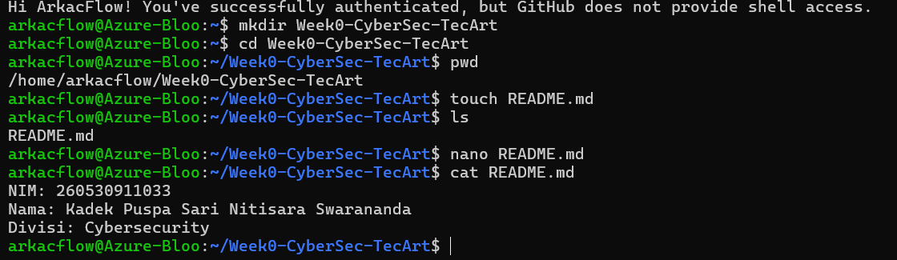
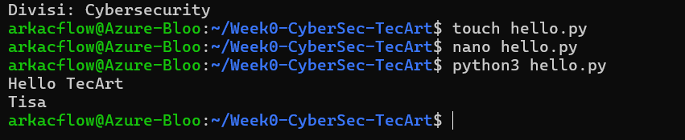
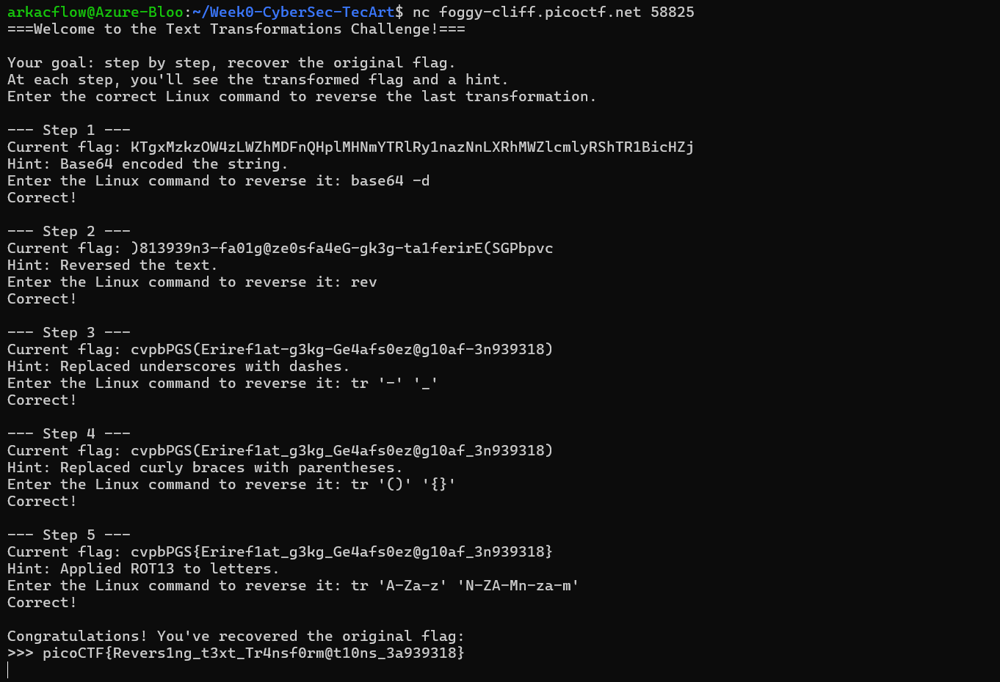
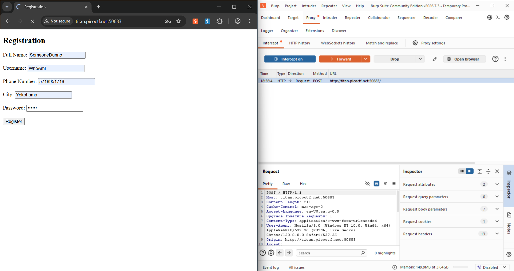
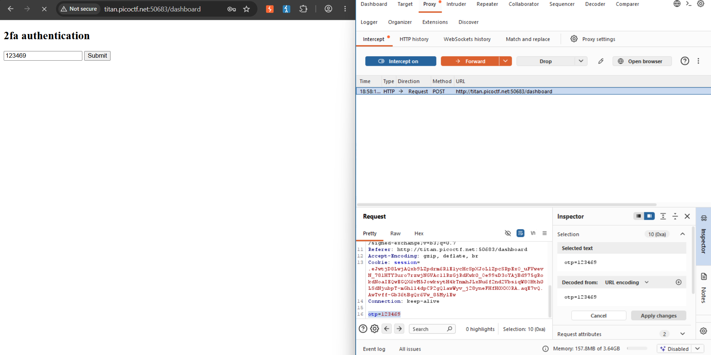
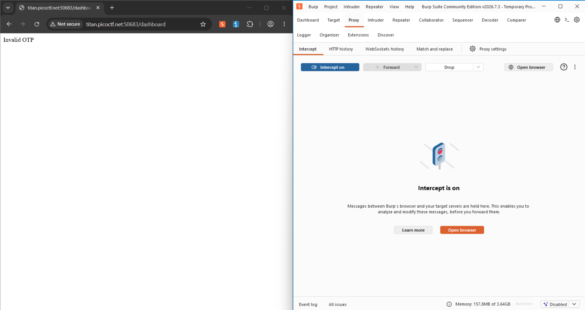
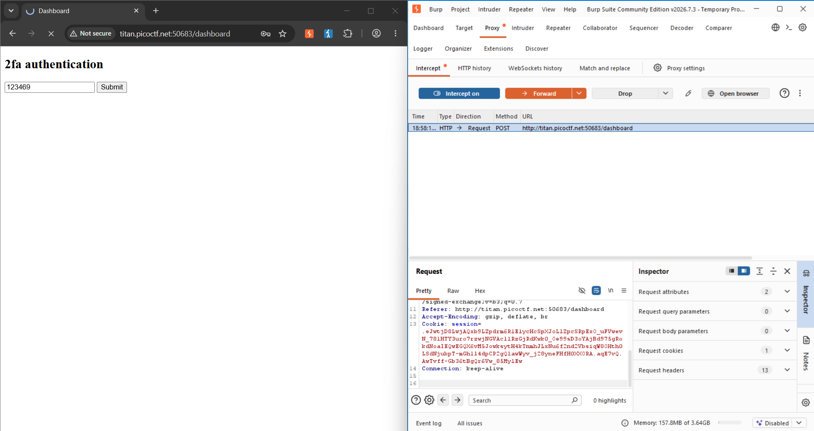
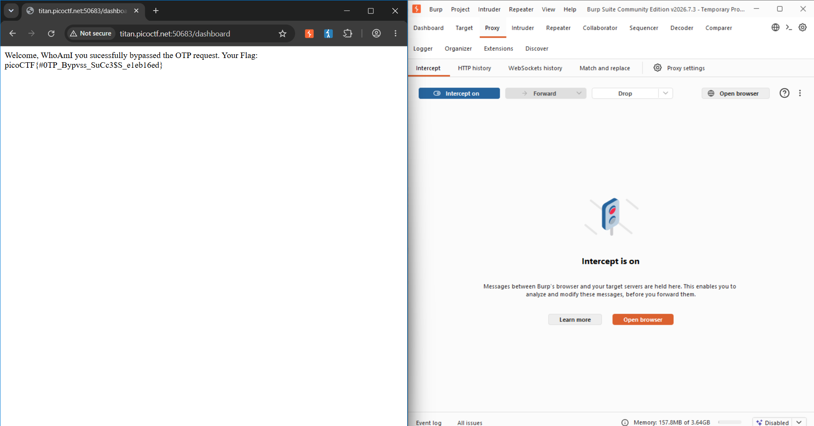

# Homework 00 Cybersecurity TecArt

## 1. Pengujian WSL
Pertama, membuat folder untuk menyimpan file tugas dengan command: mkdir Week0-CyberSec-TecArt

Kedua, masuk ke dalam folder tersebut dengan command: cd Week0-CyberSec-TecArt

Ketiga, memastikan lokasi folder yang sedang digunakan dengan: pwd

Keempat, membuat file README.md dengan: touch README.md

Kelima, memastikan file README.md telah berhasil dibuat dengan command: ls

Keenam, mengisi informasi NIM, Nama, dan Divisi ke dalam file README.md dengan: nano README.md

Ketujuh, menampilkan isi file README.md dengan command: cat README.md

## 2.Pengujian Python
Pertama, membuat file Python dengan command: touch hello.py 

Kedua, membuka file tersebut menggunakan text editor nano dengan command: nano hello.py 

Ketiga, memasukkan program sederhana untuk menampilkan tulisan "Hello TecArt" dan nama panggilan dengan: print("Hello TecArt") dan print("Tisa"). 

Ketiga, menjalankan program Python dengan command: python3 hello.py

## 3.Challenge Undo
Pertama, melakukan koneksi ke challenge menggunakan command: nc foggy-cliff.picoctf.net 58825

Kedua, hint yang diberikan adalah bahwa string telah di-encode menggunakan Base64.
Command untuk reverse hal tersebut: base64 -d

Ketiga, hint menunjukkan teks di reversed.
Command yang digunakan: rev

Keempat, hint menunjukkan underscore telah diganti jadi dash.
Command yang digunakan untuk mengganti dash menjadi underscore: tr '-' '_'

Kelima, hint menunjukkan bahwa curly braces telah diganti dengan parentheses. .
Command yang digunakan untuk membalikkannya: tr '()' '{}'

Keenam, hint menunjukkan bahwa huruf telah diproses menggunakan ROT13. Karena ROT13 dapat dibalik dengan command yang sama, digunakan: tr 'A-Za-z' 'N-ZA-Mn-za-m'

Setelah seluruh transformasi berhasil dibalik, flag asli berhasil diperoleh: picoCTF{Revers1ng_t3xt_Tr4nsf0rm@t10ns_3a939318}

## Kategori Web Challenge IntroToBurp
Pertama, start sebuah temporary project, lalu ke menu Proxy, kemudian open browser dan membuka challenge yang diberikan di dalam browser tersebut

Kedua, di dalam Proxy, hidupkan Intercept.

Ketiga, halaman pertama challenge tersebut meminta user untuk melakukan registrasi. Isi registrasi akun tersebut dengan data palsu.

Keempat, web akan stuck di loading karena intercept menyala.

Kelima, pilih forward untuk ke halaman berikutnya. Selanjutnya terdapat halaman 2fa authentication. 

Ketika diisi dengan kode OTP sembarang lalu forward, halaman selanjutnya akan menampilkan Invalid OTP.

Maka dari itu, kita kembali ke awal dan ke halaman 2fa authentication sebelumnya.
Di halaman tersebut, di dalam kotak “request” di Burp Suite, terdapat OTP dengan input yang diisi sebelumnya. 

Keenam, hapus OTP tesebut sehingga sistem mengira tidak perlu OTP untuk ke halaman selanjutnya

Ketujuh, pilih forward sehingga ke halaman berikutnya. Hasilnya adalah halaman dengan flag yang dicari.

